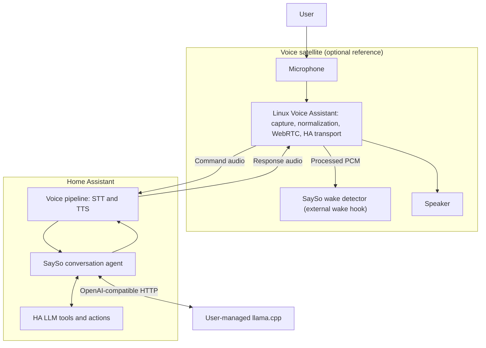

# SaySo Architecture

SaySo is a fully local voice assistant built around Home Assistant. Home
Assistant is the authoritative smart-home runtime. SaySo adds language-model
tool selection through a Home Assistant conversation agent.

SaySo consists of two independently deployable components:

1. A Home Assistant conversation agent that connects Home Assistant’s native
   LLM tools to a user-managed llama.cpp server.
2. An optional reference voice satellite under `satellite/` that adds local
   detection of the `SaySo` wake word to OHF Voice’s Linux Voice Assistant
   (LVA) using Home Assistant’s standard voice pipeline.

There is no central SaySo server, broker, add-on, or custom action API. The
SaySo Home Assistant integration does not manage or require the bundled
satellite; any compatible Home Assistant voice satellite works.

## Runtime topology

Text requests enter directly through Home Assistant’s conversation system and
follow the same path beginning at the SaySo conversation agent.

## Ownership

| Responsibility | Owner |
|---|---|
| Microphone capture and speaker playback | Linux Voice Assistant (voice satellite) |
| Volume normalization and WebRTC audio processing | Linux Voice Assistant |
| Home Assistant satellite transport | Linux Voice Assistant |
| `SaySo` wake-word detection on processed PCM | SaySo satellite overlay (external wake hook) |
| Voice pipeline orchestration | Home Assistant |
| Speech-to-text and text-to-speech | Home Assistant pipeline providers |
| Conversation history and request context | Home Assistant |
| Entity exposure and available capabilities | Home Assistant |
| Language understanding and tool selection | Model hosted by llama.cpp |
| Model transport, schema adaptation, and response handling | SaySo integration |
| Tool-call validation and correction | SaySo integration using Home Assistant schemas |
| Smart-home action execution | Home Assistant |
| Model hosting and lifecycle | User-managed llama.cpp |
| Canonical interaction trace and its storage | SaySo integration |
| Satellite-observed stage timings | SaySo satellite overlay |

Home Assistant remains authoritative for what exists, what is exposed, and what
may execute. llama.cpp proposes tool calls but cannot execute actions itself.

SaySo does not use Home Assistant’s sentence matcher for language understanding.
It does use Home Assistant’s native conversation, voice-pipeline, context, and
LLM tool APIs.

## Home Assistant conversation agent

The integration lives in `custom_components/sayso` and registers a config-entry
backed `ConversationEntity`.

For each request, the integration:

1. Receives the transcript or text, conversation history, request context, and
   currently available tools from Home Assistant.
2. Compiles Home Assistant’s tool definitions into deterministic,
   OpenAI-compatible function schemas.
3. Optionally selects a conservative schema subset using Home Assistant entity,
   area, floor, and device metadata. Uncertain routing uses the complete schema.
4. Sends the conversation and selected tools to llama.cpp through its
   OpenAI-compatible HTTP API.
5. Treats every model tool call as untrusted and validates it against the tools
   and argument schemas supplied by Home Assistant.
6. Executes valid calls through Home Assistant’s native LLM tool API.
7. Returns tool results to the model when a follow-up response is required,
   subject to a bounded iteration limit.
8. Returns the final `ConversationResult` to Home Assistant.

The integration does not call Home Assistant service endpoints directly and
does not maintain a separate entity, area, device, or capability database.

Runtime tool schemas are derived from the active Home Assistant LLM API. Any
checked-in schema artifact is a compatibility and evaluation fixture, not the
runtime authority.

## Model boundary

llama.cpp is a user-managed inference service. It has no direct access to Home
Assistant, the voice satellite, or smart-home devices. Home Assistant reaches it
through its OpenAI-compatible `/v1` HTTP API.

The model boundary follows these rules:

- Only tools currently supplied by Home Assistant may execute.
- Every tool call and its arguments must validate before execution.
- Every call in a batch must validate before any call in that batch executes.
- Schema filtering may reduce what is sent to the model but may never expand the
  capabilities authorized by Home Assistant.
- An eligible invalid response may receive one correction attempt before any
  action executes.
- No correction attempt may cause an already executed action to be repeated.
- Tool iterations are bounded.
- Failed or ambiguous validation fails closed.
- Action success is based on Home Assistant tool results, not model claims.

Schema compilation is deterministic. Schema fingerprints identify the exact tool
contract used at a model boundary without replacing Home Assistant as the source
of truth.

## Voice satellite

The bundled satellite under `satellite/` is an optional SaySo reference
satellite. It is a thin overlay on the pinned OHF Voice Linux Voice Assistant
(LVA) dependency and uses Home Assistant’s standard voice pipeline. The SaySo
Home Assistant integration does not manage or require it; any compatible Home
Assistant voice satellite works.

Linux Voice Assistant owns microphone capture, volume normalization, WebRTC
audio processing, connection to Home Assistant, command-audio transport, and
response playback. After LVA processes each audio block, it forwards the same
processed PCM to registered external wake providers. The SaySo overlay registers
an external wake hook for that feed; it does not wrap or replace LVA’s
`record()` path and does not create a second capture path.

The SaySo overlay owns:

- Loading and running the local LiveKit-compatible ONNX wake-word model on the
  processed PCM feed from LVA’s external wake hook.
- Converting a successful detection into an upstream satellite wake event.
- SaySo-specific configuration, lifecycle commands, sounds, and diagnostics.
- The smallest compatibility patches required for the supported hardware path
  (including the external wake provider and `--disable-built-in-wake-word`).

The satellite does not perform speech-to-text, text-to-speech, language
understanding, model inference, or Home Assistant action execution. It never
communicates directly with llama.cpp.

Wake detection runs locally on processed PCM and does not retain audio. It must
not start another request while the current voice pipeline is active.

## Interaction tracing

The SaySo Home Assistant integration owns the canonical trace for one voice
interaction and persists it separately from `home-assistant.log`, in a Home
Assistant `helpers.storage.Store`. There is no tracing service, collector, or
database.

The trace identifier is Home Assistant's own `PipelineRun` id. That id already
identifies exactly one end-to-end interaction, so SaySo reuses it rather than
minting a parallel one. A conversation with no voice pipeline behind it — a text
request, or a pipeline SaySo cannot resolve — falls back to a locally generated
ULID. The id is never regenerated for a downstream stage.

The satellite cannot supply that identifier. The ESPHome voice protocol carries
only `start`, `conversation_id`, `flags`, `audio_settings` and
`wake_word_phrase` on pipeline start, and Home Assistant's ESPHome integration
discards `conversation_id` instead of passing it to the pipeline. Home Assistant
therefore mints the id, and the satellite records the `conversation_id` Home
Assistant reports back on `INTENT_END` so its own timings can be joined to the
canonical trace. Introducing a second transport to carry a trace id is out of
scope for this boundary.

Each side times only what it can observe:

| Stage | Measured by | Source |
|---|---|---|
| `wake_detected` | Satellite; Home Assistant | Local detection; `wake_word-end` |
| `audio_upload_*` | Home Assistant | `stt-start` to `stt-vad-end` |
| `speech_started` / `speech_ended` | Home Assistant | Pipeline VAD |
| `stt_*` | Home Assistant | `stt-vad-end` to `stt-end` |
| `context_*`, `inference_*`, `tool_parse_*`, `ha_action_*`, `response_*` | SaySo integration | Conversation agent |
| `tts_*` | Home Assistant | `tts-start` to `tts-end` |
| `playback_*` | Satellite | Local mpv playback |

Audio transport and speech-to-text are recorded as separate stages so transport
latency is never reported as transcription latency. The satellite runs no voice
activity detector — Home Assistant's pipeline owns VAD — so no satellite VAD
stage exists. Stages that cannot be observed stay empty rather than being
fabricated.

Traces never contain audio, prompts, tool schemas, Home Assistant state dumps,
or credentials. Transcripts are treated as sensitive: they are configurable and
are redacted from exported diagnostics. Retention is bounded by both age and
interaction count, and pruning runs at save time, off the request path. A
tracing or persistence failure is logged and the voice interaction continues.

## Failure and trust boundaries

- Missing required satellite resources prevent the affected satellite from
  starting as if it were healthy.
- Model connection or response failure produces a controlled conversation error
  and never executes a guessed action.
- Unknown tools, invalid arguments, malformed batches, and exceeded iteration
  limits fail closed.
- Tool execution remains inside Home Assistant so its exposure, permission, and
  execution rules remain effective.
- User-facing responses stay concise while diagnostics retain safe failure
  classifications.
- Configured secrets are excluded from logs and exported diagnostics.
- A failed voice cycle must release its active state so later wake attempts can
  proceed.

## Deployment boundaries

A complete voice deployment contains Home Assistant running the voice pipeline
and SaySo custom integration, a llama.cpp server reachable on the local network,
and a Home Assistant-compatible voice satellite. The bundled SaySo reference
satellite under `satellite/` is optional.

Only Home Assistant communicates with llama.cpp. Satellites communicate with
Home Assistant through the standard Linux Voice Assistant path. SaySo introduces
no separate runtime protocol between these components. All required request
processing remains on the local network; SaySo does not require a cloud service.

## Repository boundaries

| Path | Responsibility |
|---|---|
| `custom_components/sayso/` | Home Assistant conversation integration |
| `satellite/sayso/` | Optional SaySo reference satellite overlay |
| `satellite/patches/` | Minimal upstream compatibility patches |
| `satellite/systemd/` | Satellite process lifecycle (system unit running as `User=sayso`) |
| `schemas/` | Reference schema artifacts |
| `evals/` | Offline and live behavioral evaluation |
| `training/` | Dataset preparation, training, export, and training evaluation |
| `tests/` | Integration-level regression tests |

Training and evaluation code is not part of the production request path.
Training design is documented in `docs/TRAINING_PLAN.md`. The model learns from
schemas Home Assistant supplies per request; `ALLOWED_HASS_TOOLS` in training
code validates examples against the pinned contract only and is not the
definition of runtime tool support.

## Architectural invariants

1. Home Assistant is authoritative for entities, exposure, context, tools, and
   action execution.
2. llama.cpp performs inference only.
3. The SaySo integration is the only bridge between model output and Home
   Assistant tools.
4. The satellite handles edge audio and wake detection, not language
   understanding or actions.
5. The satellite never communicates directly with llama.cpp.
6. SaySo has no central server, broker, or custom action protocol.
7. Model-generated tool calls never execute without validation against current
   Home Assistant tools and schemas.
8. Tool-schema filtering is an optimization and cannot grant capabilities.
9. The bundled satellite remains a thin overlay on upstream Linux Voice
   Assistant and uses Home Assistant’s standard voice pipeline.
10. Speech-to-text and text-to-speech remain Home Assistant pipeline concerns.
11. The SaySo Home Assistant integration does not manage or require the bundled
    satellite; any compatible Home Assistant voice satellite works.
12. Wake detection on the reference satellite consumes processed PCM from LVA’s
    external wake hook, not a second microphone capture path.
13. The SaySo integration owns the canonical interaction trace; the satellite is
    never the trace database.
14. One interaction has one trace identifier, reused from Home Assistant’s
    pipeline run and never regenerated for a later stage.
15. Tracing is best-effort: a tracing or persistence failure never fails a voice
    interaction.

Update this document only when component ownership, runtime communication, trust
boundaries, or an architectural invariant changes. Releases, implementation
refactors, dependency updates, and bug fixes do not require an architecture
revision unless they change one of those boundaries.
